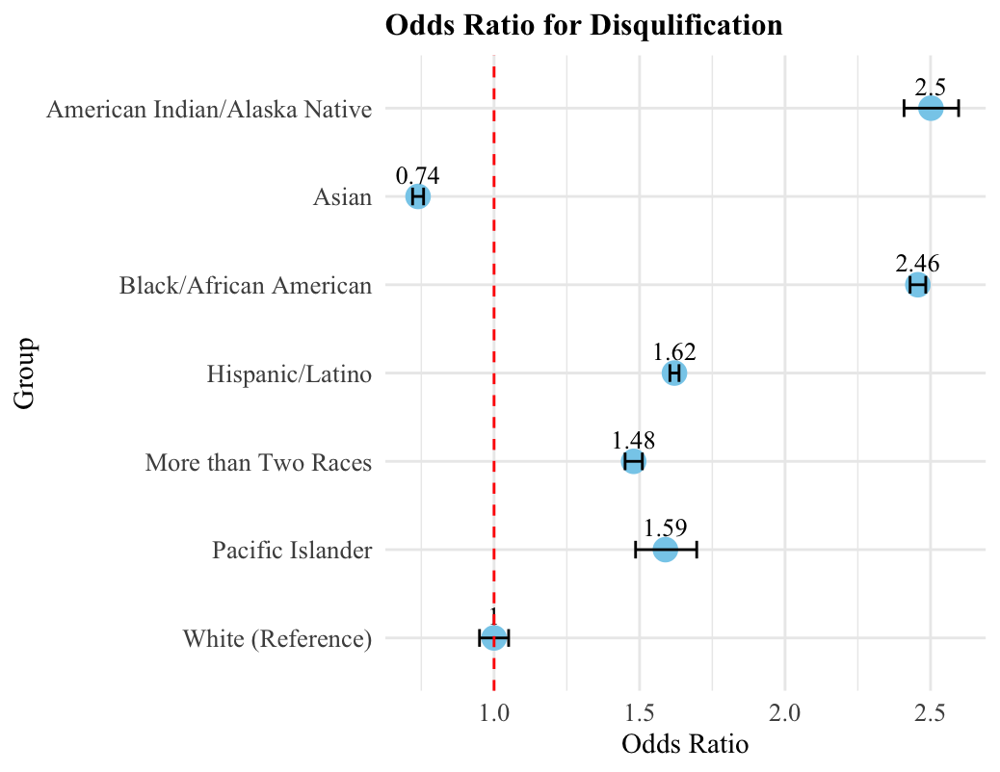

```{r setup, include=FALSE}
knitr::opts_chunk$set(echo = TRUE)
```

## Data Visualization for Equitable EI Access

In this data visualization and storytelling portfolio, I conducted a secondary data analysis of extant data. These data were published by the [Office of Special Education Programs (OSEP)](https://data.ed.gov/dataset/idea-section-618-data-products-static-tables-part-c) and [Oregon Department of Education (ODE)](https://www.oregon.gov/ode/reports-and-data/SpEdReports/Pages/default.aspx). OSEP collects annual data on children, aged 0 to 2, who have stopped receiving EI services, with information categorized by gender, race, and ethnicity.

{width="221"}

------------------------------------------------------------------------

## Datasets

Between 2013-2021, 3,310,559 infants and toddlers with disabilities and/or developmental delay received and exited from EI services nationwide (U.S. Department of Education [DOE], 2025). In Oregon, 29,945 infants and toddlers received EI services (DOE, 2025). In this study, I will first analyze data from all children eligible for EI services who stopped receiving services between 2013 and 2022.

------------------------------------------------------------------------

## Let's look at the visualizations!

{width="365"}
